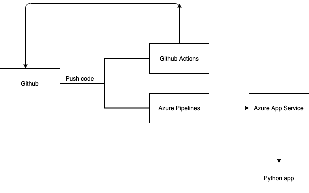
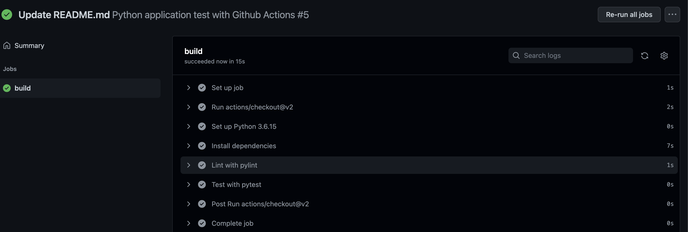
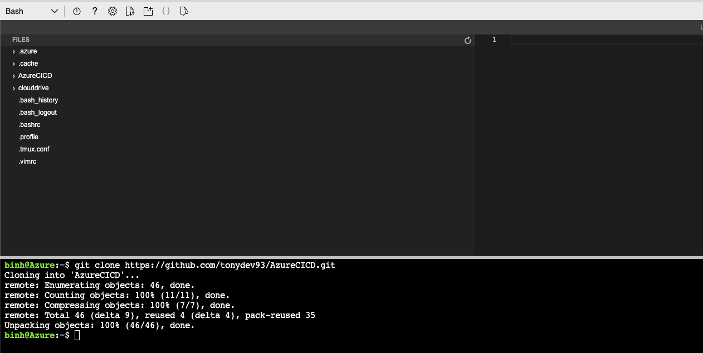
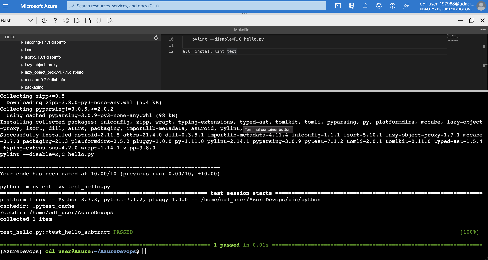
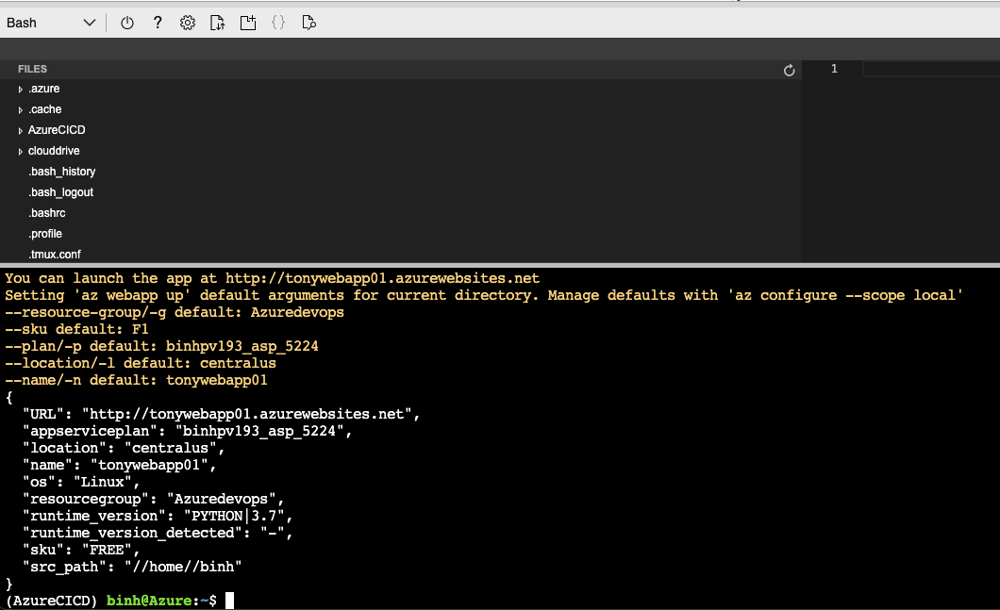
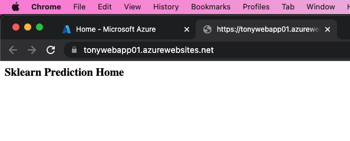
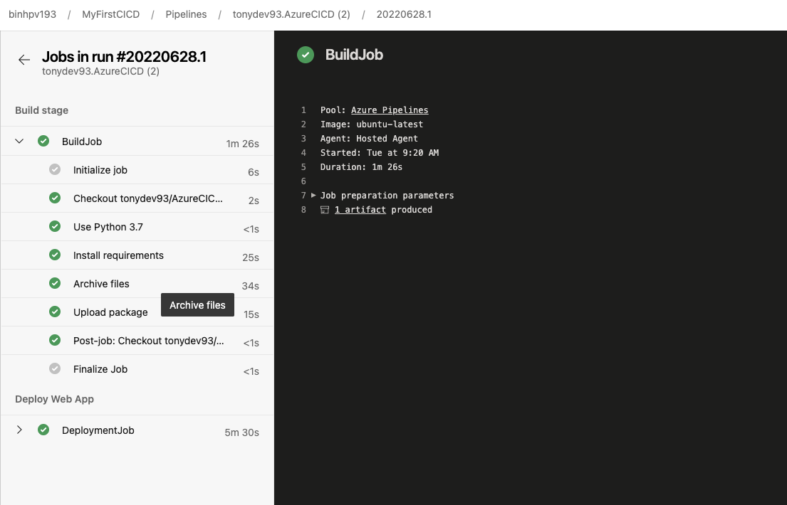
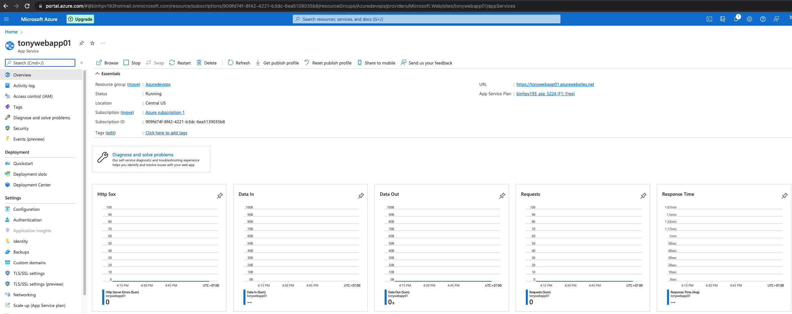
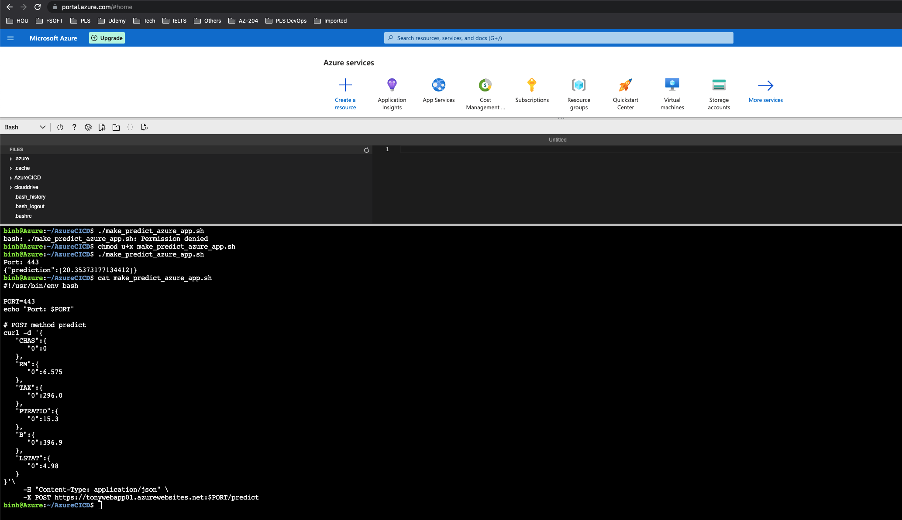
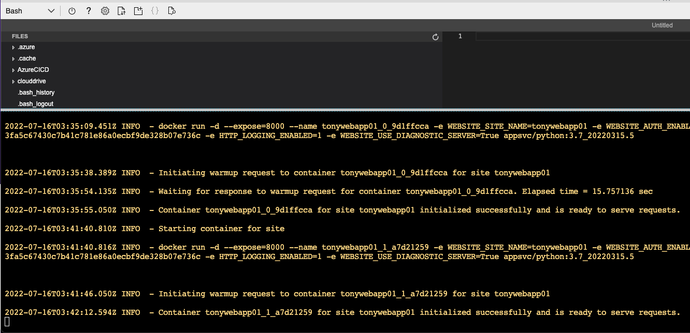

# Overview

This Python project was built to demo the way of using Continuous Integration and Continuous Delivery with Github Actions and Azure Pipelines.

## Project Plan
Trello plan:
https://trello.com/b/mTZ8NN2V/flask-app

Project plan:
https://docs.google.com/spreadsheets/d/1hI3qxaYN66A6NfrlW-e55CgmgL2sesz7Wsx2d0rNzR4/edit?usp=sharing

## Instructions



### Fork this project to your personal github account and setup Github Actions



### Clone it to Azure Cloud Shell
Open your Azure Cloud Shell and clone this project

### Create python virtual environment and source it
Running these commands in Azure Cloud Shell 
```
python3 -m venv ~/.<your-clone-repo-name>
source ~/.<your-clone-repo-name>/bin/activate
```
### Passing the test
Next, you'll run the `make all` command in your repo to install dependencies and validate your code passing linting and testing


### Deploy the app to Azure App Service
After passing the test, you want to deploy the application to the Azure App Service. Let's run this command
`az webapp up -g <your-resource-group-name> -n <your-webapp-name`
The result will be like this

Navigate to the home page of the application, you'll see this



### Build Azure Pipeline for automatic deployment
1. Create your Azure Devops Organization if you didn't have yet.
2. Create a new project
3. Create a new Pipeline, select the forked project in your github account, config it as Python to Linux Web App on Azure and run the pipeline. For more detail about creating the Azure Pipeline for Python Webapp, read the official documentation [here](https://docs.microsoft.com/en-us/azure/devops/pipelines/ecosystems/python-webapp?view=azure-devops).



4. After build the pipeline successfully, check the app service and home page again to validate it's working




5. Change your app name in [this file](make_predict_azure_app.sh), and execute it to see the prediction result



### Check the stream log
Running `az webapp log tail`, you'll see the stream log of the application


### Run load test with locust

First, install locust `pip3 install locust`

Next changing your app name in locust [config file](locust.conf)

Then running `locust` in the root project and open locust page in your local machine, you'll see the load test of your application


## Enhancements

This project can use Azure Container Instances to containerise in the future.
## Demo 

https://youtu.be/vmldVdCboLo


